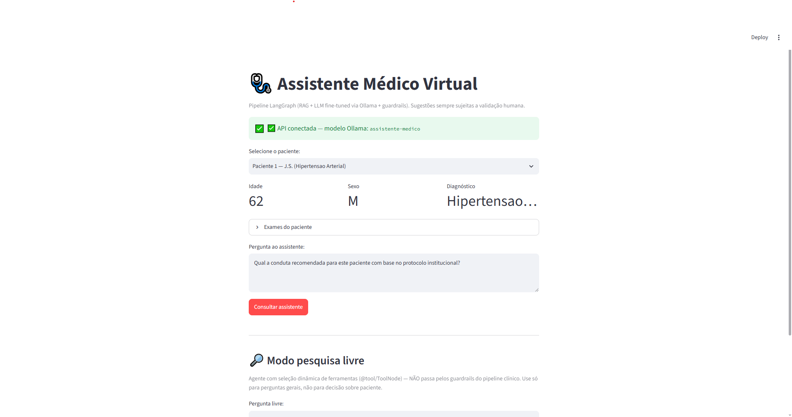
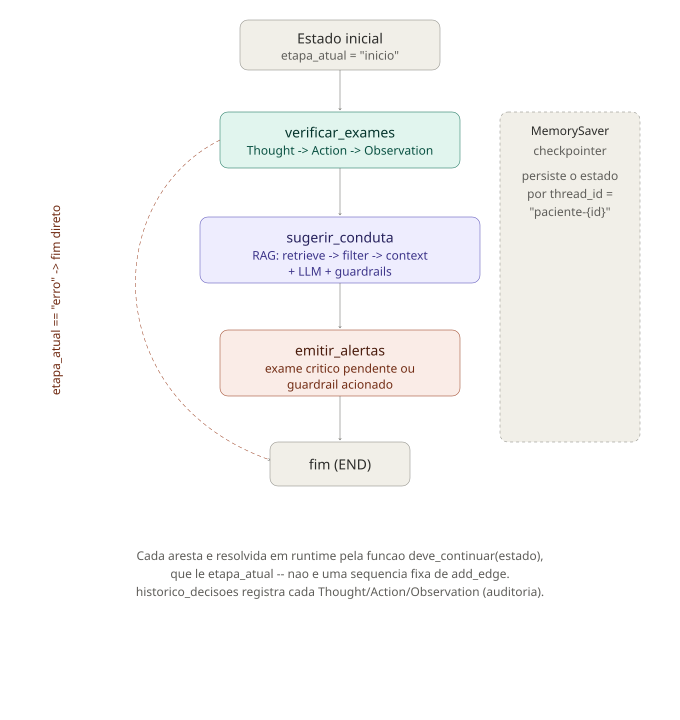

# Tech Challenge - Fase 3: Assistente Médico Virtual

Projeto da Pós-Tech em IA para Devs (Fase 3 — Generative AI). Um assistente
médico virtual que responde dúvidas de médicos e sugere condutas com base em
protocolos internos, usando um LLM com fine-tuning próprio, RAG e um fluxo de
decisão em LangGraph (verificar exames → sugerir conduta → emitir alertas).

## Estrutura

```
├── finetuning/                    # só roda no Colab (GPU) — treina o LoRA
│   ├── tech_challenge_fase3.ipynb # notebook completo: setup → fine-tuning → export
│   ├── Modelfile                  # template Ollama (ChatML + tool-calling)
│   └── src/
│       ├── preprocessing.py       # anonimização + curadoria + formato instruction-tuning
│       ├── finetune.py            # fine-tuning LoRA/QLoRA
│       ├── expand_dataset.py      # expansão com PubMedQA
│       └── expand_dataset_medquad.py  # expansão com MedQuAD (filtrado por doença)
├── assistant/                     # uso local, via Ollama, sem GPU
│   ├── diagnostico_rag.py         # diagnóstico do RAG (distância por documento)
│   ├── evaluate_rag.py            # avaliação quantitativa (precision/recall/F1)
│   ├── test_fix_context_bleed.py  # teste de regressão do RAG
│   ├── src/
│   │   ├── setup_patient_db.py    # base de pacientes simulada (SQLite)
│   │   ├── knowledge_base.py      # indexa os protocolos em FAISS
│   │   ├── states.py              # TypedDicts do RAG e do agente
│   │   ├── rag_nodes.py           # retrieve → filter_and_rank → generate_context
│   │   ├── nodes.py               # nós do agente (verificar/sugerir/alertar)
│   │   ├── graph.py               # grafo LangGraph com arestas condicionais
│   │   ├── guardrails.py          # limites de atuação + auditoria
│   │   ├── research_agent.py      # agente de pesquisa livre (@tool/ToolNode), isolado
│   │   └── main.py                # CLI — --modo conduta|pesquisa
│   ├── api/main.py                # FastAPI sobre o mesmo pipeline
│   └── app/streamlit_app.py       # interface web (Streamlit) consumindo a API
├── data/
│   ├── raw/dataset_sintetico.jsonl   # protocolos, FAQs, laudos sintéticos (10)
│   ├── raw/dataset_oficial.jsonl     # 3 protocolos oficiais reais (PCDT MS + ILAS)
│   ├── raw/dataset_completo.jsonl    # sintético + PubMedQA + MedQuAD + oficiais (71)
│   ├── processed/train.jsonl, val.jsonl  # dataset pronto para fine-tuning
│   └── db/                           # SQLite de pacientes + índices FAISS
├── docs/
│   └── diagrama_fluxo_langgraph_v2.svg
└── logs/auditoria.jsonl              # log de auditoria (guardrails)
```

`finetuning/` e `assistant/` têm `requirements.txt` próprios porque rodam em
ambientes diferentes: um só existe no Colab (GPU, treina o LoRA), o outro
roda local (CPU, usa o modelo já treinado via Ollama).

## Como rodar

**Validar o RAG localmente (sem GPU, ~1 min):**
```bash
python assistant/test_fix_context_bleed.py
```

**Rodar o assistente (Ollama já com o modelo `assistente-medico` importado):**
```bash
python assistant/src/main.py \
  --paciente-id 3 \
  --pergunta "Qual a conduta recomendada para este paciente?" \
  --backend ollama --ollama-model assistente-medico
```
Isso imprime exames pendentes, conduta sugerida, fontes consultadas, urgência,
confiança de recuperação, alertas e o histórico de decisões (Thought/Action/Observation).

**API + interface web** (mesmo pipeline, espelhando o padrão da Fase 2):
```bash
uvicorn main:app --app-dir assistant/api --port 8000
streamlit run assistant/app/streamlit_app.py
```
API em `http://localhost:8000/docs`, app em `http://localhost:8501`.



**Fine-tuning** (precisa de GPU — abrir `finetuning/tech_challenge_fase3.ipynb` no Colab
e rodar as células em ordem; T4 do Colab gratuito é suficiente).

## Arquitetura

O grafo (`assistant/src/graph.py`) tem três nós — `verificar_exames`,
`sugerir_conduta`, `emitir_alertas` — conectados por arestas condicionais
reais (`add_conditional_edges`): uma função lê o estado e decide o próximo
nó em runtime, e um erro em qualquer etapa força passagem por
`emitir_alertas` antes de encerrar (um alerta de exame crítico nunca pode
depender de a sugestão de conduta ter funcionado).

O RAG (`assistant/src/rag_nodes.py`) é um sub-pipeline de três etapas:
`retrieve_documents` (busca por similaridade de embedding no FAISS) →
`filter_and_rank` (corte por distância relativa + boost para protocolos
institucionais e documentos oficiais da mesma doença da pergunta, com
`confidence_score`) → `generate_context` (monta contexto e lista de fontes).
O `confidence_score` é usado de fato: abaixo de 0.15 dispara um alerta de
baixa confiança na resposta.

Cada nó registra `Thought`/`Action`/`Observation` em `historico_decisoes`
(trilha estilo ReAct — a base da explainability), e o grafo roda com
checkpointer `MemorySaver` por `thread_id`.



Existe também um agente separado de pesquisa livre
(`assistant/src/research_agent.py`, `--modo pesquisa`), que decide sozinho
qual ferramenta chamar (`@tool`/`ToolNode`). Ele é isolado do fluxo clínico
de propósito: um agente que escolhe dinamicamente o que fazer não pode
substituir um fluxo fixo onde "verificar exames críticos" é obrigatório em
toda execução.

## Dataset e fine-tuning

Como não há dados reais de pacientes/hospital disponíveis, o dataset é
sintético: protocolos (hipertensão, diabetes, sepse, alta hospitalar), FAQs
de médicos e modelos de laudo/receita. Ele foi complementado com dados reais
sugeridos no enunciado — PubMedQA e MedQuAD (filtrado por doença) — e com 3
protocolos oficiais brasileiros (PCDT do Ministério da Saúde para
hipertensão/diabetes, protocolo do ILAS para sepse), formando
`data/raw/dataset_completo.jsonl` (71 registros).

`finetuning/src/preprocessing.py` anonimiza CPF/data/telefone via regex e
converte cada registro para o formato instruction-tuning
(`instruction`/`input`/`output`):
```bash
python finetuning/src/preprocessing.py \
  --input data/raw/dataset_completo.jsonl \
  --output-dir data/processed \
  --val-size 0.15
```

O fine-tuning usa LoRA + quantização 4 bits sobre `Qwen/Qwen2.5-1.5B-Instruct`
(aberto, sem gate), viável em uma GPU T4:
```bash
python finetuning/src/finetune.py \
  --base-model Qwen/Qwen2.5-1.5B-Instruct \
  --train-file data/processed/train.jsonl \
  --val-file data/processed/val.jsonl \
  --output-dir models/assistente-medico-lora \
  --epochs 3
```
O adaptador é depois fundido ao modelo base, convertido para GGUF/q4_k_m e
importado no Ollama (célula 10 do notebook) — é assim que o modelo roda
localmente sem GPU. O modelo publicado neste repositório foi treinado com o
`dataset_completo.jsonl` acima; o notebook e os arquivos em `data/processed/`
já refletem esse dataset.

## RAG: avaliação e limitações

`assistant/evaluate_rag.py` mede precision/recall/F1/hit@k do retrieval sem
chamar o LLM (determinístico). Evolução medida ao longo do projeto, à medida
que o corpus cresceu: precisão 0.50 → 0.58 (MedQuAD) → 0.64 (+ documentos
oficiais); hit@k se manteve em 1.00 (o protocolo certo sempre aparece no
contexto). Recall caiu no processo porque o denominador (documentos
relevantes no corpus inteiro) cresce junto — não é regressão do sistema.

O modelo de embedding (`all-MiniLM-L6-v2`) não é especializado em domínio
médico; isso é mitigado com boost por tipo de documento e corte relativo de
distância, mas é uma limitação conhecida (Seção 5 do relatório).

O agente de pesquisa livre (`--modo pesquisa`) reconhece as ferramentas mas,
com o modelo fine-tuned, não chega a emitir a chamada estruturada — só pede
mais detalhes em texto livre. Com o modelo de fábrica (`qwen2.5:1.5b`, sem o
LoRA) a mesma pergunta funciona normalmente. Não é bug de código nem do
template Ollama (ambos testados); a explicação mais provável é que o
fine-tuning, sem exemplos de tool-calling no dataset, degradou parcialmente
essa capacidade do modelo base. Comparação completa no relatório.

## Segurança e auditoria

`assistant/src/guardrails.py` bloqueia/ajusta respostas que soem como
prescrição direta e definitiva, sempre anexando o aviso de validação humana
obrigatória, e registra cada interação em `logs/auditoria.jsonl`.

## Entregáveis da Fase 3

- Repositório com pipeline de fine-tuning, integração LangChain e fluxos LangGraph
- Dataset sintético + dados reais complementares (`data/raw/`)
- Relatório técnico: fine-tuning, arquitetura, diagrama e avaliação, descritos
  neste README
- Vídeo demonstrativo (até 15 min) — gravação pendente
